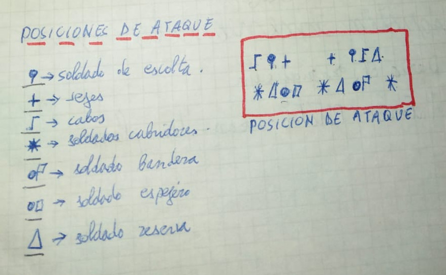

<!-- La Banda de los Dragones -->

# Prólogo

Ésta es una transcripción de dos hojas halladas recientemente en los sótanos de la historia.

# Alistados a la Banda

| Miembro      | SI                | NO    |
|:-------------|:------------------|:------|
| Tanis        | X                 |   |
| José Tomás   | X                 |   |
| Luís         | X                 |   |
| Abelardo     | X                 |   |
| Candi        | X                 |   |
| Rafa         | X                 |   |
| Juan Cris    | X                 |   |
| Carmelo      |                   | X |
| Javi         |                   |   |
| Agustín      | X                 |   |
| Darío        | X                 |   |
| Antonio      | X                 |   |
| Tino         | X                 |   |
|              | X                 |   |

### Armas que lleva cada uno

* Lanza
* Espada

# Hora y lugar de reunión

Habrá que reunirse **lunes, miércoles** y **viernes** en el _???_ viejo. El que falte más de cinco veces, y que pueda venir y no venga, será expulsado de la banda.

> Si falta por razones concretas como ir a solfa, a meca, a judo, etc., no se le expulsará.

La hora de reunión es a las cinco (5).

# Puntos que veremos mañana en la reunión

1.  Se verá quién de los que dijeron "Sí" han venido o no.
1.  Se pasará a nombrar cargos a los miembros de la banda (cabo, soldado,...).
1.  Se pasará a realizar las primeras pruebas y se jurará bandera.
1.  Se buscará un buen campamento y se distribuirán armas.

# Campamentos a elegir por medio de votación 

(A mano alzada)

| Campamento          |T |JT|L |A |C |R |JC|CA|J |AG|D |
|:--------------------|:-|:-|:-|:-|:-|:-|:-|:-|:-|:-|:-|
| Balsa Perico        |  |  |  |  |  |  |  |  |  |  |  |
| Bancal de José María|  |  |  |  |  |  |  |  |  |  |  |
| Garrofero           |  |  |  |  |  |  |  |  |  |  |  |

# Posiciones de ataque

